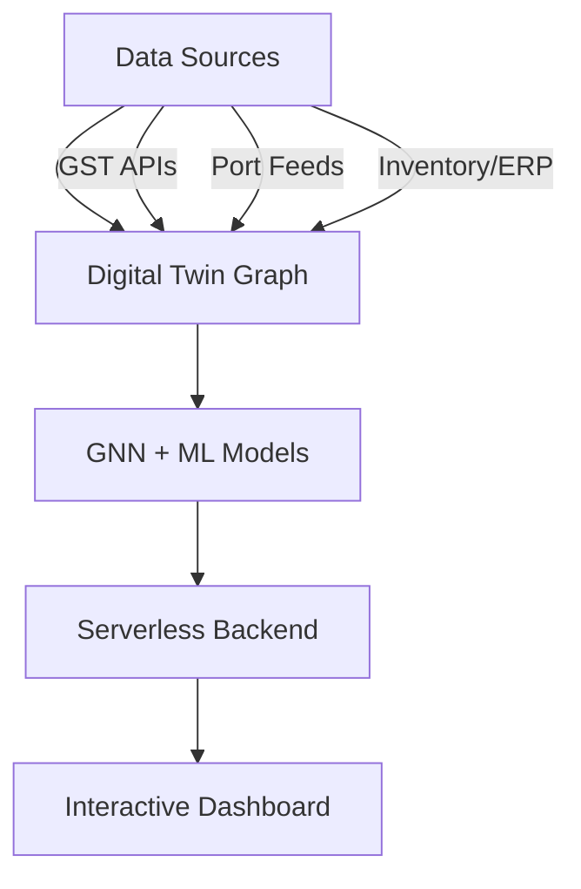

  

<h1 align="center">🟢 Vyaapti (व्याप्ति)</h1>
<h3 align="center"><i>Extending intelligent logistics to every corner of Bharat</i></h3>

  A cloud-native, AI-powered <b>Green Supply Chain Digital Twin</b> for MSMEs in India.

  
  
  

---

## 🔍 Overview

**Vyaapti (व्याप्ति)** is a scalable **digital twin platform** designed to empower Indian MSMEs with real-time, AI-driven insights into their supply chain operations.

It focuses on:
- ✅ Energy and carbon tracking  
- ✅ Delay prediction using **GST e-waybill** + **AIS port data**  
- ✅ Inventory & logistics risk monitoring

---

## 🧩 Problem Statement

> India’s MSMEs are the economic backbone — yet face critical challenges in:
> - Managing carbon emissions  
> - Handling supply chain delays  
> - Responding to disruptions and risks  

🧠 Traditional tools are expensive, heavy, and not designed for small businesses.  
🌱 Vyaapti offers a **lightweight, intelligent, and green digital twin** tailored for MSMEs.

---

## 💡 Why This Matters

- 📉 Carbon reporting is becoming **mandatory**  
- ⚠️ MSMEs suffer from **fragile, opaque logistics**  
- 🚛 Disruptions need **predictive, real-time response**  
- 🔋 Efficient, **low-carbon supply chains** = better margins + compliance  

> **🔗 Vyaapti = AI-native, cloud-powered, MSME-ready**

---

## 🧠 System Architecture

## ⚙️ Tech Stack
- Layer	Tools/Tech
- Data	GST APIs, AIS Port Feeds
- ML/GNN	PyTorch Geometric, Scikit-learn
- Backend	Firebase Functions / AWS Lambda
- Frontend	React + Tailwind CSS / Flutter Web
- Database	Firebase Firestore / AWS DynamoDB
- Hosting	Firebase Hosting / Render / AWS
  
---

## 🧪 Prototype Roadmap
Phase	Description
✅ Phase 1: Simulation	Create mock data, simulate logistics
🔁 Phase 2: Graph + GNN	Build graph, apply GNNs for delay prediction
🔜 Phase 3: Dashboard	Real-time frontend with alerts & emissions UI

---

## 🌐 Real-World Use Cases
🔹 Agri Exporters – Cold chain carbon tracking (e.g., Himachal apples)

🔹 Textile MSMEs – Shipment delay predictions (e.g., Tiruppur)

🔹 Port Clusters – Congestion-aware rerouting (e.g., Mundra, Chennai)

---

## 🌱 Impact Goals
♻️ Smarter route planning to reduce emissions

📊 Predictive inventory and delay risk management

🇮🇳 Aligns with Net-Zero, Bharat MSME, and Make-in-India initiatives

---

## 🚀 Vision
"A Digital Twin that doesn’t just mirror the supply chain —
but makes it smarter, greener, and resilient to disruption."

---

<i>Made with 🇮🇳 by Hrudhay H along with Team ZERO</i>
 
